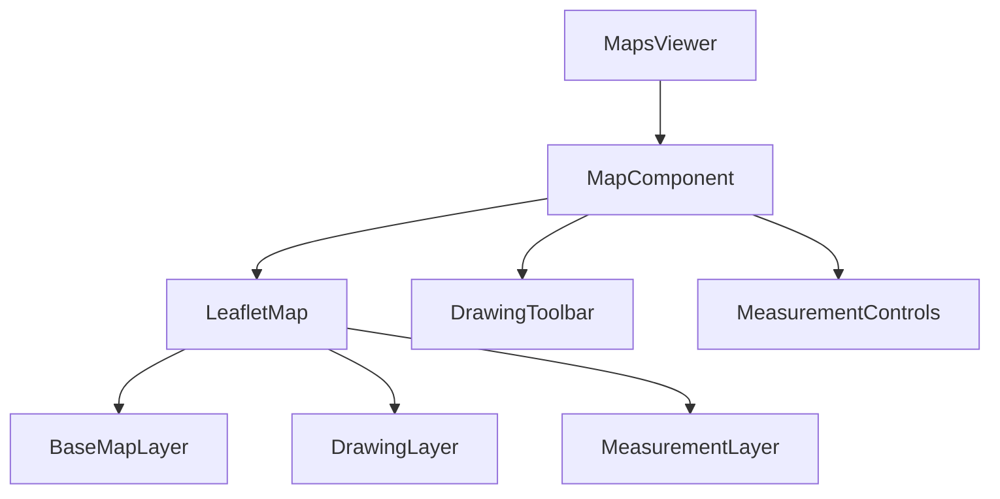
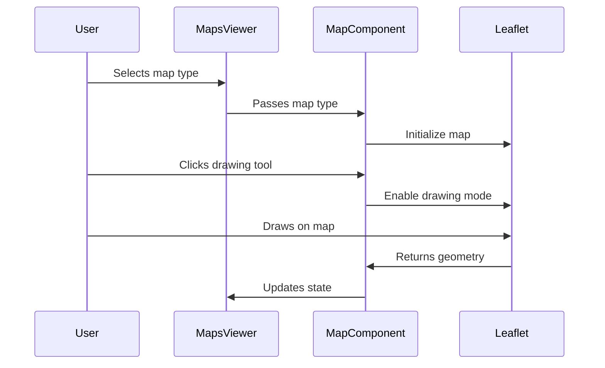

# Interactive Map Upgrade Architecture

## Overview
This document outlines the architecture for upgrading the interactive map with advanced drawing and measurement tools using Leaflet.js.

## Current State Analysis
- Current implementation uses Google Maps iframes for interactive maps
- Other map types display static maps from Google Drive
- No drawing or measurement capabilities exist

## Target Architecture

### 1. Technology Stack
- **Base Map Library**: Leaflet.js (lightweight, open-source, easy to integrate)
- **Drawing Tools**: Leaflet.draw plugin
- **Measurement Tools**: Leaflet.measure plugin
- **UI Components**: Existing Radix UI components for toolbar

### 2. Component Structure



### 3. MapComponent Architecture

The new `MapComponent` will:
- Initialize a Leaflet map instance
- Load appropriate base layers based on map type
- Provide drawing capabilities (polygon, line, marker)
- Enable distance and area measurements
- Manage tool state and interactions

### 4. Toolbar Design

```
Map Tools Toolbar:
┌─────────────────────────────────┐
│ [Polygon] [Line] [Marker] [Measure] │
│ [Clear All] [Save] [Export]      │
└─────────────────────────────────┘
```

### 5. Data Flow



### 6. Implementation Steps

1. **Install Dependencies**: Add Leaflet and plugins to package.json
2. **Create MapComponent**: New component with Leaflet integration
3. **Implement Drawing Tools**: Polygon, line, marker drawing
4. **Add Measurement Tools**: Distance and area calculation
5. **Design Toolbar UI**: Using existing Radix UI components
6. **Integrate with MapsViewer**: Replace iframe with new component
7. **Test and Validate**: Ensure all features work correctly

### 7. Technical Considerations

- **Performance**: Leaflet is lightweight and should work well
- **Compatibility**: Ensure works with existing React setup
- **State Management**: Use React state for tool management
- **Error Handling**: Graceful fallback if Leaflet fails to load

### 8. Future Enhancements

- Save/load drawn features
- Export drawings as GeoJSON
- Collaboration features
- Custom styling for drawings