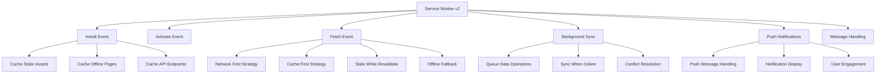
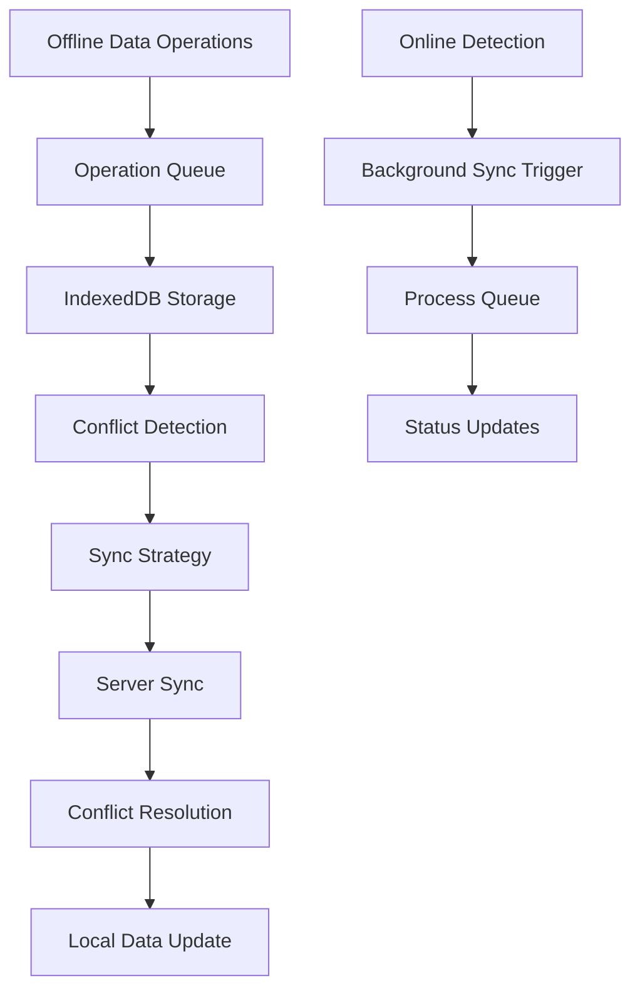
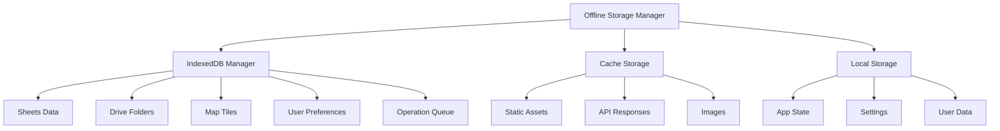

# Advanced PWA Features Implementation Architecture

## Overview

This document outlines the implementation plan for advanced PWA features to enable desktop installation and offline functionality for the MDRRMO Pio Duran application.

## Current State Analysis

### Existing Infrastructure
- Basic service worker with limited caching
- IndexedDB setup for offline storage
- Tile caching service for map tiles
- WebSocket service for real-time collaboration
- Map component with offline tile loading capabilities

### Identified Gaps
1. No PWA manifest file for desktop installation
2. Limited service worker functionality (no push notifications, advanced caching)
3. No offline-first data synchronization system
4. Missing offline indicators and connection status management
5. No offline fallback pages or error handling
6. No background sync for data operations
7. No PWA installation prompts or user guidance
8. No push notification support

## Implementation Architecture

### 1. Enhanced Service Worker (`/frontend/public/service-worker-v2.js`)



### 2. PWA Manifest (`/frontend/public/manifest.json`)

```json
{
  "name": "MDRRMO Pio Duran Dashboard",
  "short_name": "MDRRMO Dashboard",
  "description": "Disaster Risk Reduction and Management Office Dashboard for Pio Duran",
  "start_url": "/",
  "display": "standalone",
  "theme_color": "#009688",
  "background_color": "#ffffff",
  "orientation": "portrait-primary",
  "scope": "/",
  "icons": [
    {
      "src": "/icons/icon-72x72.png",
      "sizes": "72x72",
      "type": "image/png",
      "purpose": "any maskable"
    },
    {
      "src": "/icons/icon-96x96.png",
      "sizes": "96x96",
      "type": "image/png",
      "purpose": "any maskable"
    },
    {
      "src": "/icons/icon-128x128.png",
      "sizes": "128x128",
      "type": "image/png",
      "purpose": "any maskable"
    },
    {
      "src": "/icons/icon-144x144.png",
      "sizes": "144x144",
      "type": "image/png",
      "purpose": "any maskable"
    },
    {
      "src": "/icons/icon-152x152.png",
      "sizes": "152x152",
      "type": "image/png",
      "purpose": "any maskable"
    },
    {
      "src": "/icons/icon-192x192.png",
      "sizes": "192x192",
      "type": "image/png",
      "purpose": "any maskable"
    },
    {
      "src": "/icons/icon-384x384.png",
      "sizes": "384x384",
      "type": "image/png",
      "purpose": "any maskable"
    },
    {
      "src": "/icons/icon-512x512.png",
      "sizes": "512x512",
      "type": "image/png",
      "purpose": "any maskable"
    }
  ],
  "categories": ["productivity", "utilities", "maps"],
  "screenshots": [
    {
      "src": "/screenshots/dashboard.png",
      "sizes": "1280x720",
      "type": "image/png",
      "form_factor": "wide"
    },
    {
      "src": "/screenshots/maps.png",
      "sizes": "1280x720",
      "type": "image/png",
      "form_factor": "wide"
    }
  ],
  "shortcuts": [
    {
      "name": "Maps",
      "short_name": "Maps",
      "description": "View interactive maps and data",
      "url": "/maps",
      "icons": [{ "src": "/icons/map-icon.png", "sizes": "96x96" }]
    },
    {
      "name": "Dashboard",
      "short_name": "Dashboard",
      "description": "View main dashboard",
      "url": "/",
      "icons": [{ "src": "/icons/dashboard-icon.png", "sizes": "96x96" }]
    }
  ],
  "related_applications": [],
  "prefer_related_applications": false
}
```

### 3. Offline-First Data Synchronization System



### 4. Advanced Caching Strategies

#### Cache Strategy Matrix

| Content Type | Strategy | Cache Duration | Fallback |
|--------------|----------|----------------|----------|
| Static Assets | Cache First | 30 days | Network |
| API Data | Network First | 5 minutes | Cache |
| Map Tiles | Cache First | 7 days | Offline Tile |
| Images | Cache First | 14 days | Placeholder |
| Documents | Network First | 1 hour | Cache |

### 5. Offline Storage Architecture



## Implementation Components

### 1. Enhanced Service Worker Features

- **Advanced Caching**: Multiple strategies based on content type
- **Background Sync**: Queue and sync data operations when online
- **Push Notifications**: Handle offline notifications
- **Offline Pages**: Serve fallback pages when offline
- **Resource Preloading**: Preload critical resources
- **Cache Management**: Automatic cache cleanup and optimization

### 2. PWA Installation System

- **Manifest Integration**: Complete PWA manifest with icons and metadata
- **Installation Prompt**: Custom installation prompt component
- **Install Detection**: Detect if app is installed
- **Desktop Integration**: Proper desktop app behavior

### 3. Offline Data Management

- **Operation Queue**: Queue data operations when offline
- **Conflict Resolution**: Handle data conflicts during sync
- **Data Validation**: Validate data before syncing
- **Progress Tracking**: Track sync progress and status

### 4. Connection Status Management

- **Real-time Monitoring**: Monitor connection status changes
- **Offline Indicators**: Visual indicators for offline status
- **Graceful Degradation**: Handle offline scenarios gracefully
- **Reconnection Logic**: Automatic reconnection when online

### 5. Push Notification System

- **Service Worker Integration**: Handle push messages in service worker
- **Notification Display**: Show notifications when app is offline
- **User Engagement**: Engage users with relevant notifications
- **Permission Management**: Handle notification permissions

## File Structure

```
frontend/
├── public/
│   ├── manifest.json                    # PWA manifest
│   ├── service-worker-v2.js            # Enhanced service worker
│   ├── offline.html                    # Offline fallback page
│   ├── icons/                          # PWA icons
│   │   ├── icon-72x72.png
│   │   ├── icon-96x96.png
│   │   ├── icon-128x128.png
│   │   ├── icon-144x144.png
│   │   ├── icon-152x152.png
│   │   ├── icon-192x192.png
│   │   ├── icon-384x384.png
│   │   └── icon-512x512.png
│   └── screenshots/                    # App screenshots
│       ├── dashboard.png
│       └── maps.png
├── src/
│   ├── components/
│   │   ├── PWAManager.js              # PWA installation manager
│   │   ├── OfflineIndicator.js        # Connection status indicator
│   │   ├── OfflineFallback.js         # Offline fallback component
│   │   └── NotificationManager.js     # Push notification manager
│   ├── hooks/
│   │   ├── useOfflineStatus.js        # Offline status hook
│   │   ├── useInstallationPrompt.js   # Installation prompt hook
│   │   └── useBackgroundSync.js       # Background sync hook
│   ├── services/
│   │   ├── OfflineDataManager.js      # Offline data operations
│   │   ├── SyncQueueManager.js        # Sync queue management
│   │   └── NotificationService.js     # Push notification service
│   ├── utils/
│   │   ├── offlineUtils.js            # Offline utility functions
│   │   ├── syncUtils.js               # Sync utility functions
│   │   └── notificationUtils.js       # Notification utility functions
│   └── context/
│       └── OfflineContext.js          # Offline state context
```

## Implementation Phases

### Phase 1: Foundation (Week 1)
- [ ] Create PWA manifest and icons
- [ ] Implement enhanced service worker
- [ ] Create offline fallback pages
- [ ] Set up offline context and hooks

### Phase 2: Core Functionality (Week 2)
- [ ] Implement offline data synchronization
- [ ] Create connection status management
- [ ] Add offline indicators and notifications
- [ ] Implement background sync system

### Phase 3: User Experience (Week 3)
- [ ] Create PWA installation prompts
- [ ] Add push notification support
- [ ] Implement advanced caching strategies
- [ ] Create offline-first data operations

### Phase 4: Polish and Testing (Week 4)
- [ ] Comprehensive offline testing
- [ ] Performance optimization
- [ ] User experience improvements
- [ ] Documentation and deployment

## Technical Requirements

### Browser Support
- Chrome 80+
- Firefox 75+
- Safari 14+
- Edge 80+

### PWA Requirements
- HTTPS (required for service workers)
- Valid manifest.json
- Service worker registration
- 192x192 icon
- 512x512 icon

### Offline Capabilities
- IndexedDB for data storage
- Cache Storage API for resources
- Background Sync API for data operations
- Push API for notifications

## Success Metrics

1. **Installation Rate**: Track PWA installation conversions
2. **Offline Usage**: Monitor offline functionality usage
3. **Sync Success Rate**: Measure background sync success rate
4. **User Engagement**: Track notification engagement
5. **Performance**: Measure offline page load times
6. **Reliability**: Monitor service worker reliability

## Risk Mitigation

1. **Browser Compatibility**: Test across all target browsers
2. **Storage Limits**: Implement storage management and cleanup
3. **Data Conflicts**: Implement robust conflict resolution
4. **Network Issues**: Handle various network conditions gracefully
5. **User Experience**: Ensure smooth transitions between online/offline states

This architecture provides a comprehensive foundation for implementing advanced PWA features that will enable desktop installation and robust offline functionality for the MDRRMO Pio Duran application.