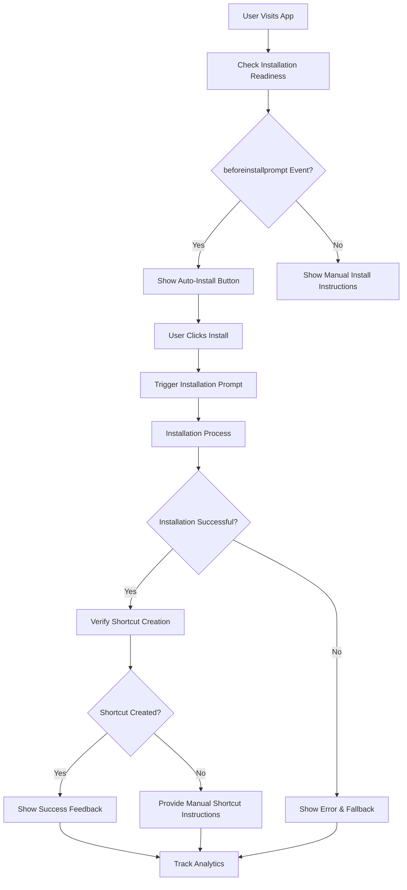

# PWA Auto-Install Architecture

## Overview

This document outlines the architecture for enhancing the PWA installation experience with auto-install functionality and desktop shortcut creation for the MDRRMO Pio Duran application.

## Architecture Components

### 1. Auto-Install Button Component

**Location**: `frontend/src/components/AutoInstallButton.js`

**Responsibilities**:
- Detect PWA installation readiness using `beforeinstallprompt` event
- Provide visual feedback during installation process
- Handle installation success/failure states
- Integrate with existing PWAInstallationPrompt component

**Key Features**:
- Prominent UI button with installation status
- Real-time installation progress indicators
- Success confirmation with desktop shortcut information
- Error handling with fallback instructions

### 2. Enhanced PWA Installation Prompt

**Location**: `frontend/src/components/PWAInstallationPrompt.js` (enhanced)

**Responsibilities**:
- Detect when app is ready for installation
- Manage deferred installation prompts
- Provide user guidance for installation
- Handle cross-browser compatibility

**Enhancements**:
- Auto-install button integration
- Desktop shortcut creation verification
- Post-installation success feedback
- Analytics tracking integration

### 3. Desktop Shortcut Manager

**Location**: `frontend/src/services/DesktopShortcutManager.js`

**Responsibilities**:
- Manage desktop shortcut creation
- Verify shortcut creation post-installation
- Handle browser-specific shortcut creation
- Provide fallback mechanisms

**Key Features**:
- Shortcut creation detection
- Browser capability checking
- User guidance for manual shortcut creation
- Success verification

### 4. Installation Analytics Service

**Location**: `frontend/src/services/InstallationAnalytics.js`

**Responsibilities**:
- Track installation attempts and success rates
- Monitor desktop shortcut creation
- Collect browser compatibility data
- Provide analytics dashboard

**Key Features**:
- Event tracking for installation flow
- Error logging and reporting
- Success rate monitoring
- User behavior analytics

### 5. Cross-Browser Compatibility Layer

**Location**: `frontend/src/utils/browserCompatibility.js`

**Responsibilities**:
- Detect browser capabilities
- Provide fallback mechanisms
- Handle browser-specific quirks
- Feature detection

**Key Features**:
- Browser capability detection
- Feature availability checking
- Fallback implementation
- User guidance for unsupported browsers

## Implementation Flow



## Technical Specifications

### Auto-Install Button Component

```javascript
// Key methods
- detectInstallationReadiness()
- handleInstallClick()
- showInstallationProgress()
- handleInstallationSuccess()
- handleInstallationError()
- provideFallbackInstructions()
```

### Desktop Shortcut Manager

```javascript
// Key methods
- checkShortcutCreationSupport()
- createDesktopShortcut()
- verifyShortcutCreation()
- provideManualShortcutInstructions()
- getBrowserSpecificInstructions()
```

### Installation Analytics

```javascript
// Key methods
- trackInstallationAttempt()
- trackInstallationSuccess()
- trackInstallationError()
- trackShortcutCreation()
- getInstallationStats()
```

## Integration Points

### 1. PWA Manifest Integration

```json
{
  "shortcuts": [
    {
      "name": "Dashboard",
      "short_name": "Dashboard",
      "description": "View main dashboard",
      "url": "/",
      "icons": [{"src": "/icons/dashboard-icon.png", "sizes": "96x96"}]
    },
    {
      "name": "Maps",
      "short_name": "Maps",
      "description": "View maps and documentation",
      "url": "/maps",
      "icons": [{"src": "/icons/maps-icon.png", "sizes": "96x96"}]
    }
  ]
}
```

### 2. Service Worker Integration

```javascript
// Enhanced service worker for installation tracking
self.addEventListener('appinstalled', (event) => {
  console.log('App installed:', event);
  // Track installation success
  // Verify shortcut creation
  // Send analytics data
});
```

### 3. App Component Integration

```javascript
// Main App.js integration
function App() {
  const [isInstalled, setIsInstalled] = useState(false);
  const [showInstallPrompt, setShowInstallPrompt] = useState(false);
  
  useEffect(() => {
    // Check installation status
    // Listen for installation events
    // Initialize analytics
  }, []);
  
  return (
    <>
      <AutoInstallButton />
      <PWAInstallationPrompt />
      {/* Rest of app */}
    </>
  );
}
```

## Success Metrics

### Target Metrics
- **Installation Rate**: 40% of eligible users
- **Shortcut Creation Rate**: 90% of successful installations
- **User Satisfaction**: 4.5/5 rating for installation experience
- **Error Rate**: <5% installation failures

### Tracking Metrics
- Installation attempts per day
- Installation success rate
- Shortcut creation success rate
- Browser compatibility issues
- User feedback on installation process

## Implementation Timeline

### Phase 1: Core Implementation (2-3 days)
- Auto-Install Button component
- Enhanced PWA Installation Prompt
- Desktop Shortcut Manager
- Basic analytics tracking

### Phase 2: Integration & Testing (1-2 days)
- Integration with existing components
- Cross-browser testing
- Error handling improvements
- User feedback collection

### Phase 3: Optimization & Documentation (1 day)
- Performance optimization
- Documentation updates
- User guide creation
- Final testing and deployment

## Browser Compatibility Matrix

| Browser | Auto-Install Support | Desktop Shortcut Support | Notes |
|---------|---------------------|--------------------------|-------|
| Chrome 96+ | ✅ Full | ✅ Full | Native support |
| Edge 96+ | ✅ Full | ✅ Full | Native support |
| Firefox 90+ | ⚠️ Partial | ⚠️ Manual | Requires manual install |
| Safari 15+ | ⚠️ Partial | ⚠️ Manual | Limited PWA support |
| Opera 80+ | ✅ Full | ✅ Full | Native support |

## Fallback Strategies

### For Browsers Without Auto-Install Support
1. **Manual Installation Instructions**
   - Browser-specific step-by-step guides
   - Visual instructions with screenshots
   - Video tutorials

2. **Alternative Installation Methods**
   - Downloadable installer packages
   - App store listings
   - Progressive enhancement

3. **User Education**
   - Clear explanations of benefits
   - Comparison of installation methods
   - Support contact information

## Security Considerations

### Data Privacy
- No sensitive data collected during installation
- Analytics data anonymized
- User consent for tracking

### Permission Handling
- Clear permission requests
- Explanation of required permissions
- Option to decline without affecting functionality

### Error Handling
- Graceful degradation
- Clear error messages
- Recovery options

## Documentation Requirements

### User Documentation
- Installation guide with screenshots
- Troubleshooting section
- FAQ for common issues
- Browser-specific instructions

### Developer Documentation
- Component API documentation
- Integration guide
- Testing procedures
- Maintenance instructions

### Technical Documentation
- Architecture diagrams
- Sequence diagrams
- Error handling flowcharts
- Performance benchmarks

## Next Steps

1. **Implementation**: Create AutoInstallButton component
2. **Enhancement**: Update PWAInstallationPrompt with auto-install features
3. **Service**: Implement DesktopShortcutManager
4. **Analytics**: Create InstallationAnalytics service
5. **Testing**: Cross-browser compatibility testing
6. **Documentation**: Update user and developer documentation
7. **Deployment**: Roll out to production with monitoring

This architecture provides a comprehensive foundation for implementing seamless PWA auto-install functionality with desktop shortcut creation, ensuring a smooth user experience across different browsers and devices.